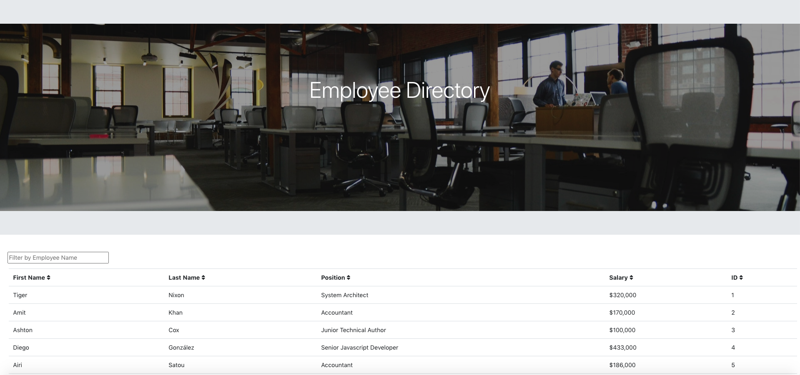

# Assignment 19 – React Homework: Employee Directory

## Overview

In this assignment, I created an employee directory with React. The assignment required me to break up the application's UI into components, manage component state, and respond to user events.

## User Story

```
AS a user, 
I WANT to be able to view my entire employee directory at once, 
SO THAT I have quick access to their information.
```
- - -

## Acceptance Criteria

```
GIVEN a table of random users, 
WHEN the user loads the page, 
THEN a table of employees should render. 

WHEN the user clicks on the sort button of a particular column,
THEN that items in that column are sorted in ascending order.

WHEN the user types an employee's name into the input bar,
THEN the data on that particular employee is filtered from the table.
```
- - -

## Usage

* In order to run the following react application, first clone the GitHub repository to your local device.
* Then, open the project root directory in the terminal window, and run "npm install" 
* After the libraries needed to run the application have been installed, run the "npm start" file through node
* If you are not automatically redireced to it, navigate to the URL: http://localhost:3000/ in order to view the web application


## Features

The user is able to:

  * Sort the table by at least one category.

  * Filter the users by at least one property.

## Application Screenshot



## Accesories and Technologies Used:
* HTML
* CSS
* [Bootstrap](https://getbootstrap.com/)
* [Font Awesome](https://fontawesome.com/)
* JSX
* React
* JSON
* Web Manifest
* Service Worker
* [Visual Studio Code](https://code.visualstudio.com/)
* [Google Chrome](http://www.google.com/chrome)
* [Node.js](https://nodejs.org/en/)
* Git/Terminal
* [GitHub](https://github.com/)
* [Netlify](https://www.netlify.com/)


## Submission on BCS

* The URL to the deployed application: https://happy-aryabhata-281606.netlify.app/

* The URL to the Github repository: https://github.com/MG-cpu90/assignment19 
